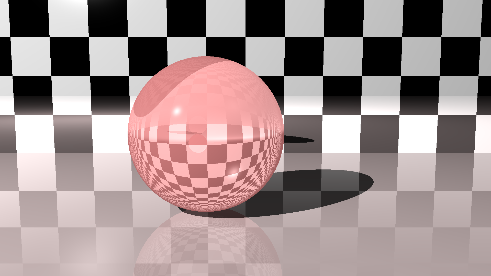

<h1 align="center">miniRT</h1>

<i>
 A simple Ray Tracer 
</i>

## About

This project is a recriation of miniRT from 42 school as an exercise to help me to fix some concepts of raytracing. The [original project](https://github.com/librity/ft_minirt) was made with [lpaulo-m](https://github.com/librity), but I decided to implement it from scratch using my own [libft](https://github.com/pedro-pn/libft_complete) and going further in The Ray Tracing Challange book chapters.

## Description

This project is a Ray Tracer coded in C using [minilibx](https://github.com/42Paris/minilibx-linux) library.

---

### Implemented:

- [x] Spheres;
- [x] Planes;
- [x] Cubes;
- [x] Phong reflection model;
- [x] Shadows;
- [x] Patterns;
- [x] Reflection;
- [x] Refraction;
- [x] Multi-thread renderization;
- [X] Cylinders;
- [X] Cones;
- [X] Groups;
- [X] Bounding boxes optmization;
- [X] Bounding Volume Hierarchies (BVH);
- [X] Triangles;
- [X] Wavefront OBJ file parser;
- [X] Smooth Triangles;
- [X] Parser scene;

### To implement:

- [ ] Cones in scene;
- [ ] Groups in scene;
- [ ] Triangles in scene;
- [ ] Patterns in scene;
- [ ] Wavefront in scene;
- [ ] Multiple lights;
- [ ] CSG;
- [ ] Focal Blur;
- [ ] Soft shadows;
- [ ] Anti-aliasing;
- [ ] Texture maps;

---
#### Work in progress...
---

### Rendered images

#